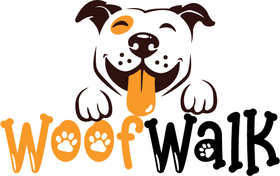

# WoofWalk

WoofWalk is a dog walking service platform designed to connect dog owners with trusted dog walkers. Users can browse available walkers, book sessions, and leave reviews for their walkers. The platform also allows dog walkers to create profiles, set pricing, and manage their bookings.

## Prerequisites
Before running the project, ensure that you have the following installed:
* Node.js
* npm (comes with Node.js)
* SQLite3

## Setup Instructions
1. Install Dependencies
   `npm install`

2. Build the Database
   * On macOS or Linux:
     `npm run build-db`
   * On Windows:
     `npm run build-db-win`

3. Start the Web App
   `npm run start`

   The web app will be available at http://localhost:3000.

## Key Routes
Here are some important routes in the application:
* **Homepage**: `http://localhost:3000/`
* **Sign In**: `http://localhost:3000/sign-in`
* **Sign Up**: `http://localhost:3000/sign-up`
* **Booking**: `http://localhost:3000/booking`
* **About Us**: `http://localhost:3000/about`
* **Contact Us**: `http://localhost:3000/contact-us`

## Folder Structure
The key files and folders in this project are:
* **/views**: Contains all the EJS templates for rendering HTML pages.
* **/routes**: Contains the route definitions for the application.
* **/public**: Holds the static assets like CSS files and images.
* **Database and Schema Files**: Located at the root of the project directory.
